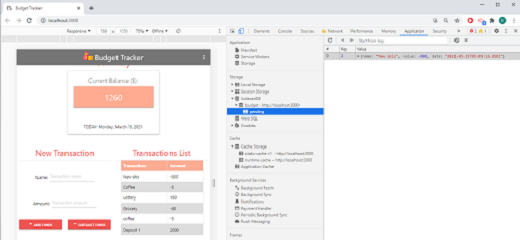

# 18-Budget_Tracker_PWA  

<span align="center">   

---

 <a href="https://img.shields.io/badge/express-v4.17.1-orange?style=plastic"></a>
<a href="https://img.shields.io/badge/DB-MongoDB-yellow?style=plastic"></a>
<a href="https://img.shields.io/badge/npm-Mongoose-red?style=plastic"></a>
<a href="https://img.shields.io/badge/npm-morgan-blue?style=plastic"></a>
 <a href="https://img.shields.io/badge/License-MIT-brightgreen?style=plastic"></a>  
 
 </span>

---

## Table of Contents  
* [Description](#Description)
* [User Story and Details](#User-Story-and-Details)  
* [Installation and Usage](#Installation-and-Usage)  
* [Images of the app](#Images-of-the-app-)  
* [License](#License)  
* [Contact](#Contact) 


## Description
This application helps you to track your budget online as well offline: You can add deposits and expenses to your budget with or without a connection. It uses [Express](https://www.npmjs.com/package/express), [MongoDB](https://www.mongodb.com/), [Mongoose](https://www.npmjs.com/package/mongoose),  [Morgan](https://www.npmjs.com/package/morgan) and [Materialize](https://materializecss.com/about.html).  


## User Story and Details


```
User Story Acceptance Criteria
```
```
AS AN avid traveller
I WANT to be able to track my withdrawals and deposits with or without a data/internet connection.  
WHEN the user inputs a withdrawal or deposit offline
THEN that will be shown on the page, and added to their transaction history when their connection is back online    
SO THAT my account balance is accurate when I am traveling. 
```

:information_source:  
A service worker allows the app to run offline by caching all data, including the css library. 
When offline, new transactions are saved to the pending collection in IndexedDB. When back online, all the pending collection is written to the online MongoDB and deleted from IndexedDB.  

## Installation and Usage  
You can use directly the [deployed app](https://homework-18-budget-tracker-pwa.herokuapp.com/) on Heroku or run it locally with the following steps: 
- Open a terminal instance  
- Clone the following [repo](https://github.com/Delph-Sunny/18-Budget_Tracker_PWA)  
- In the working directory, install the dependencies package with the following code line `npm i`  
- Once the dependencies have been installed, enter `npm start` 

## Images of the App :mag:  
New app Frontend:  
  
Manifest and service Worker:    
  
Offline with IndexedDB:  
   

## License  

Copyright (c) 2021 DT. This project is [MIT](https://choosealicense.com/licenses/mit) licensed.

## Contact  

:octocat:  GitHub: [Delphine](https://github.com/Delph-Sunny)  

---
